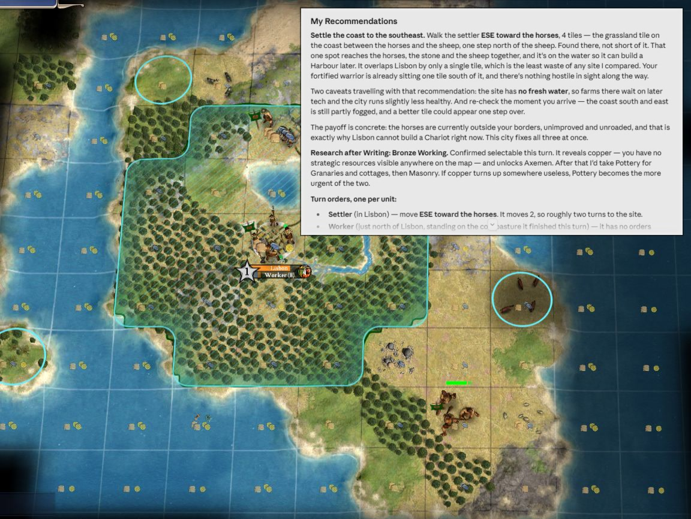

# Civ4 Advisor

Play **Civilization IV: Beyond the Sword** with Claude as your strategic advisor.

A mod writes what you can see each turn to a JSON state file. Claude Code reads that file, along with the game's own rules data, and advises you what to build, where to settle, what to research and where to move. It takes no actions and only ever sees what you can see, fog of war included.

Works best in the early game up to Classical era but has no hard turn limit.

**Curious how it's built?**

- **[`docs/MODDING.md`](docs/MODDING.md)** for Civ IV modding: how we extract game state data and make it available to the AI agent.
- **[`docs/ADVISOR.md`](docs/ADVISOR.md)** for the AI side, Civ IV knowledge optional: how the agent and its harness process the game data, how we make it deliver clear advice, and where it hit its limits.

## What it looks like

You end a turn, then tell Claude "done". It reads the new state file, thinks about what's going on, then provides recommendations like this:



That is a real turn, unedited. The advice names units, landmarks, and compass bearings to easily identify the map tiles it's talking about:

> **Settle the coast to the southeast.** Walk the settler **ESE toward the horses**, 4 tiles — the grassland tile on the coast between the horses and the sheep, one step north of the sheep. Found there, not short of it. That one spot reaches the horses, the stone and the sheep together, and it's on the water so it can build a Harbour later. It overlaps Lisbon by only a single tile, which is the least waste of any site I compared. Your fortified warrior is already sitting one tile south of it, and there's nothing hostile in sight along the way.
>
> Two caveats travelling with that recommendation: the site has **no fresh water**, so farms there wait on later tech and the city runs slightly less healthy. And re-check the moment you arrive — the coast south and east is still partly fogged, and a better tile could appear one step over.

It runs its own internal tools for the things the AI model isn't good at: reading the map, tracking changes across turns, and looking up the game's rules rather than recalling them incorrectly from other civ versions. [How that works](docs/ADVISOR.md).

## Requirements

- **Windows.** The mod runs inside the game, which is Windows-only.
- **Civilization IV: Beyond the Sword**, installed and working.
- **[Claude Code](https://claude.com/download)**, signed in, with a paid Claude plan (it is not included in the free tier). The desktop app is the easiest way to use it; the `claude` command-line tool also works.
- **[Python 3](https://www.python.org/downloads/)** (3.8 or newer). During installation, **tick "Add python.exe to PATH"**. Claude uses it to run its own tools.

You don't need to know how to code.

## Setup

Download this repo (green **Code** button, then **Download ZIP**, and unzip it somewhere you will keep it, or `git clone` if you prefer). Then **double-click `setup.bat`**.

It finds your Civ IV install and settings folder, shows you what it found, and asks you to confirm. Then it links the mod into your MODS folder, writes the two config files, turns on the game's Python logging, and puts a **Civ IV - civ4-advisor** shortcut on your Desktop. Nothing is written until you have confirmed both paths. You can re-run it at any time.

No administrator rights are needed.

If it cannot find your install, tell it where to look. From a command prompt in that folder:

```bash
setup.bat -InstallPath "D:\path\to\Sid Meier's Civilization IV Beyond the Sword"
```

To check an existing setup at any time if something is not working, **double-click `verify.bat`**.

<details>
<summary>Doing it by hand instead</summary>

Four steps. Replace `C:\path\to\civ4-advisor` with wherever you put this repo, and `<MyGames>` with your Civ IV settings folder — normally `%USERPROFILE%\Documents\My Games\Beyond the Sword`. It is the folder containing `CivilizationIV.ini`.

**1. Link the mod into your MODS folder.** The folder name must be exactly `civ4-advisor` — Beyond the Sword requires `Mods\<Name>\<Name>.ini`:

```bash
mklink /J "<MyGames>\MODS\civ4-advisor" "C:\path\to\civ4-advisor\mod"
```

This is a junction, not a copy, so the files stay in one place. It needs no administrator rights. Note that the `Mods` folder inside your *install* directory is a different one holding the stock mods — putting it there does nothing.

**2. Create `mod\Assets\Python\LocalConfig.py`** by copying `LocalConfig.py.example` beside it and setting the paths:

```python
STATE_DIR = r'C:\path\to\civ4-advisor\state'
MOD_PYTHON_DIR = r'C:\path\to\civ4-advisor\mod\Assets\Python'
LOG_TIMINGS = False
```

**Without this file the mod loads, runs, and writes nothing** — no error, no popup. If it's not working with no error, this is the most likely reason.

**3. Create `config.local.json`** at the repo root by copying `config.local.json.example`, and set `civ4_install_path` to the folder *containing* `Beyond the Sword` (for a default Steam install, that is the `Sid Meier's Civilization IV Beyond the Sword` folder under `steamapps\common`). `civ4_mods_path` is documentation only — no code reads it.

**4. In `<MyGames>\CivilizationIV.ini`**, set:

```ini
LoggingEnabled = 1
HidePythonExceptions = 0
```

Without the first, the game's Python log stops updating after startup and you have no way to diagnose anything.

</details>

## Playing a game

**1. Launch the game** with the Desktop shortcut it created. (Or start Civ IV normally and choose **Advanced → Load a Mod → civ4-advisor**; the game restarts into it.) The main menu shows `civ4-advisor` once it has loaded.

**2. Start a game** as usual. When the game is loaded and you see the game start popup, the mod writes a file into a new folder under `state\`, named for your leader.

**3. Set up the advisor for that game** — once per game. Double-click **`new_game.bat`**.

It lists the games it can see, newest first, and the one you just started is the default — so pressing Enter is usually the right answer:

```
Which game?
  [1] Pacal          turn 0    2 min ago
  [2] Joao           turn 48   2 days ago

Press ENTER for the most recent [1], or a number:
```

Then it asks where to put the advisor folder, offering your Desktop:

```
Where should the advisor folder go?
  C:\Users\you\Desktop\civ-pacal
Press ENTER to use that, or type another path:
```

Anywhere outside this repo is fine.

Each game needs its own advisor folder. To start a new game, run `new_game.bat` again.

**4. Open that folder in Claude Desktop.** Go to the **Code** tab, click **Select folder**, and pick the folder the script just made.

**Set the model to Sonnet 5 with medium effort.** That is the recommended default for this; using Opus or higher effort significantly increases thinking time.

Then give it this to start:

> Read your instructions, then look at my position and tell me what to do.

<details>
<summary>Or use the command line</summary>

If you prefer the `claude` command-line tool, the script prints the exact commands:

```bash
cd %USERPROFILE%\Desktop\civ-pacal
claude
```

Then give it the same starting message. Everything below works the same either way.

</details>

Then each turn: play, hit End Turn, and tell Claude "done", "what now?", anything. **There is no automatic trigger; you need to prompt it to check.** It reads the latest turn files itself, so you do not need to tell it what happened. Feel free to play multiple turns in between prompts, it will look at everything that happened since the last prompt.

Do tell it when something happened between turns that the start of turn game state doesn't show. Examples are combat, goody hut pops, or diplomatic deals made.

## When it isn't working

**Double-click `verify.bat` first**. It checks each piece and says which one failed without changing anything.

| Symptom | Cause |
|---|---|
| No files appear under `state\` | `mod\Assets\Python\LocalConfig.py` is missing. This is the number one cause, and it fails silently — the game looks completely normal. |
| `civ4-advisor` not in the mod list | The junction is missing, or points at the `Mods` folder inside your install instead of the one in Documents. |
| Files stop updating mid-game | If your Documents folder is in OneDrive, sync can break the link. Run `setup.bat` again. |
| Claude reports it cannot run its tools, or that `python` was not found | Python is not on your PATH. Reinstall it with "Add python.exe to PATH" ticked. |
| Uninstall says "Access to the path ... is denied" | OneDrive sets a read-only flag on the mod link after a while. `uninstall.bat` clears it now; if you hit this on an older copy, run `attrib -r` on that folder first. |
| Something looks wrong in-game | Check `Logs\PythonDbg.log` in your Civ IV settings folder. It needs `LoggingEnabled = 1`, which setup sets for you. |

Editing the mod yourself? Only `AdvisorStateWriter.py` reloads live; `CvCustomEventManager.py` and `LocalConfig.py` both need a full game restart — see [`mod/README.md`](mod/README.md).

## Removing it

Double-click **`uninstall.bat`**.

Unlinks the mod and removes the shortcut. Civ IV goes back to running unmodded.

It never touches your save files and **your mod files are not deleted**. The link is a signpost, so removing it leaves everything it pointed at where it is. Your exported game state files under `state\` are kept too; add `-IncludeState` to delete those as well, and `-RestoreIni` to roll back the two `CivilizationIV.ini` settings.

## Limitations

Worth knowing before you try it:

- **Early game.** The advisor and tools are built for the early game up to the Classical era where game complexity is relatively low.
- **No religions, espionage, corporations.** The advisor has no visibility and will only be able to give general advice on these topics.
- **Prompt it at the start of your turn.** Nothing fires automatically and it's not able to see actions you take during your turn live.
- **Advice quality.** Claude struggles with spatial reasoning, doesn't know what the UI looks like, and it sometimes confuses rules with other Civ editions. It sometimes forgets to use its tools like mapping; if it gives nonsense advice, ask it to check using its tools.
- **Uses your plan allowance.** On the recommended Sonnet 5 at medium effort, 50 turns typically takes less than half of a 5-hour limit window.
- **Single player only.** Never tested in multiplayer.

## How it works

Three parts, connected only by a JSON file on disk:

- **[`mod/`](mod/)** — runs inside Civ IV's embedded Python 2.4 interpreter. Hooks the turn cycle and writes a snapshot of player-visible state each turn. It never decides anything, and is built to never crash the game.
- **[`harness/`](harness/)** — external Python 3 tools an agent invokes: `render_map.py` (spatial views), `run_history.py` (reasoning across turns), `rules.py` (lookups against the game's own XML) and `bearing.py`. Stdlib only.
- **[`advisor/`](advisor/)** — the advisor's standing instructions: how to read the state, how to answer, what to check every turn. `new_game.bat` builds a per-game folder from these, and that generated folder — not this repo — is what you open in Claude Code.

There is no API client and there will not be one, because an agentic coding tool reads these files directly. That deletes a whole layer: no prompt assembly, no retry handling, no API keys, and no subsystem to parse and cache the game's XML rules (the agent just reads them). It costs the automatic trigger — you prompt it each turn — and makes prompt quality harder to iterate on, since there is no single prompt to A/B.

The state format is specified in [`schema/`](schema/), and [`CLAUDE.md`](CLAUDE.md) carries the architecture and every design decision with its reasoning. [`ROADMAP.md`](ROADMAP.md) is what is not built yet.

Detailed writeups: [`docs/MODDING.md`](docs/MODDING.md) for the game-side Python, [`docs/ADVISOR.md`](docs/ADVISOR.md) for the agent side.

## License

MIT — see [`LICENSE`](LICENSE).

No Firaxis SDK headers, binaries, game assets or XML are included in this repo. The one exception is [`mod/Assets/Python/EntryPoints/CvEventInterface.py`](mod/Assets/Python/EntryPoints/CvEventInterface.py), a 34-line stub from the base game with two lines changed and a comment added explaining why: a mod cannot hook the game's events without overriding it, and redistributing it is long-standing practice in the Civ IV modding community. `REFERENCES.md` also quotes a few short expressions from the publicly published Beyond the Sword SDK, cited by file and line, to explain behaviour the mod depends on.
