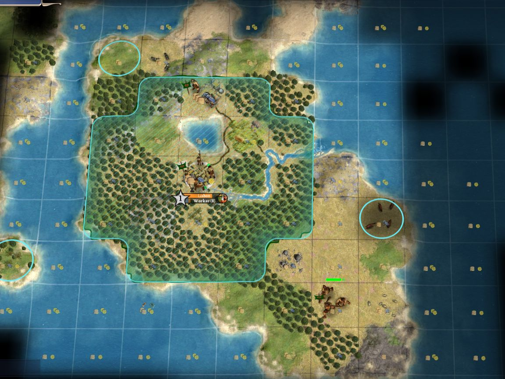
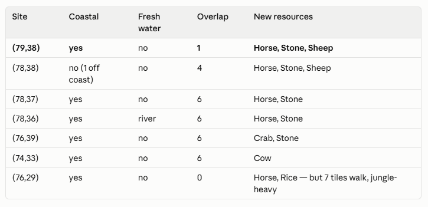

# Making an agent a useful advisor in a complex strategy game

This is the AI side of [civ4-advisor](../README.md). You don't need to be familiar with the game Civilization IV, but some general knowledge about AI agents and harnesses may be useful.

## Part 1 — What this is, and why this game

### What the game is about

Civilization IV is a turn-based strategy game played on a grid of tiles. The player guides a civilization from early history to the modern day, competing with other, computer-controlled civilizations. Tiles have terrain and resources that determine what they produce. You move units around the map, found cities, choose what each city does, and pick technologies to research. There is no time limit for each turn. A typical game has several hundred turns.

You can only see what's visible to your units, not the whole map. Everywhere else you remember the terrain from when you last saw it, but not what is on it now. A rival's army that walked past one of your units last turn is simply gone from view this turn. The player doesn't know what a rival civilization is researching or where their cities are, except when witnessed first-hand.

### The goal

Each turn, an agent reads the player-visible state of that game and advises the player on what to do: what to build, where to move units, what to research, where to put the next city. The agent can provide detailed guidance to newcomers as well as discuss strategy with advanced players. Execution is always up to the player, the agent has no way to directly control the game.

### Why this game specifically

- **Turn-based, so model latency is free.** Nothing is happening in-game while the agent thinks.
- **Complex but well-understood.** The game's systems are complex and interrelated so they test the agent's ability to reason. At the same time, due to its popularity and longevity, the game is well-understood, giving the agent knowledge and resources to work with.
- **Existing scripting and rules layers.** The game exposes a full Python API over its own state, so we can extract structured data from inside the running game rather than pointing a vision model at the screen. Likewise, the game's rules are exposed as XML files so the agent can look up specifics as needed.
- **Hidden information is real here.** "Tell the agent only what the player can see" is a constraint with a checkable answer. The honesty property is testable rather than aspirational: reading any given turn's file gives exactly what was visible at that moment.

## Part 2 — How it works

Three parts, connected only by a JSON file on disk.

**The mod** runs inside the game, hooks the end of each turn, and writes a snapshot of player-visible state. It has its own writeup: [`MODDING.md`](MODDING.md) which is about using the game's Python layer rather than about AI.

**The harness** is a handful of external Python scripts, standard library only, that read those files and render them into forms an agent reasons over well.

**The agent** is an agentic coding tool pointed at a folder containing the state files with its own standing instructions on what to do and how to invoke the harness tools: [`AGENT_GUIDE.md`](../harness/AGENT_GUIDE.md).

### Using Claude Code rather than an AI model via API

Claude code gives us full agentic behavior out of the box. Memory, tool use, the chat interface, error handling, it's all there.

The tradeoffs are:

- **No automatic trigger.** Nothing fires when you end a turn; you prompt the agent to look.
- **Weaker prompt iteration.** Instructions live in version-controlled markdown, which is fine, but there's no single deterministic prompt to A/B and no automatic log of state→advice pairs to evaluate later. Improvements are judged from reading transcripts.

### The state file is a deliberate snapshot of a point in time

Each snapshot reports only what is visible *now*, mirroring the game engine. Rival units appear only if currently in sight. A rival's army seen on turn 14 is absent from turn 15's file.

The **sequence** of files restores what a human player retains: spotting that army at all tells you something about the rival's technology, and that inference stays valid long after the unit drops out of sight. Reading turn 14's file gives exactly what the player could see on turn 14, which the agent can refer to on later turns using the harness or its own memory.

**A past turn is evidence about the past; only the latest turn is current state.** Units move around and a city that was small on turn 14 is not small now.

### What gets a tool

A harness tool is worth building only where the agent is unreliable reading the raw JSON.

This bar matters because the tempting move is to build a tool for everything. The agent reads JSON well: filtering units, comparing cities, checking research all work unaided, so most of the export needs no tooling at all. The measured gaps are narrow: spatial reasoning, aggregation across many files, and consistent arithmetic over many rows.

- **Map rendering** — ASCII grids of the map, five views each cut to one decision, plus a zoomed report around a candidate location.
- **Run history** — what changed turn by turn, a per-rival dossier, and which of your own units disappeared.
- **Rules lookups** — queries against the game's own XML, priced for this specific game's settings.
- **Bearings** — wrap-aware compass direction between two points, for reasons [Part 3](#the-compass-problem) explains.

### What the agent actually sees

Here is turn 34 of a real game. The player has just built a settler and has to decide where the second city goes. This is the map on screen:



And this is the same ground, rendered for the agent by the `settle` view:

```
  N ^ NORTH
     71   |72   |73   |74   |75   ||76   |77   |78   |79   |80   ||81   |
  32   .  | -   | -   | -   |Ad  ~|| -   |Ad  ~| -   | -   | ~   || ~   | 32
  33 Agf ~| -   |Ag  ~|Ap *~|AG  ~||Ag  ~| -   | -   | ~   | ~   ||  .  | 33
  34 AP  ~| -   |xgf ~|xGf :|xp *:||xpf %|xpf ~| -   | ~   |  .  || ~   | 34
  35  -   | -   |xGf ~|xg  :| o   ||xp */|xpf &| -   | -   | ~   || ~   | 35
  36  -   | -   |xpf ~|xpf :|Cp  :||xgf /|xpf &|AP  &| -   | -   || ~   | 36
  37  -   | -   |xgf ~|xPf ~|xpf*_||xgf /|xgf /|Ap  ~|Ap *~| -   || ~   | 37
  38 Agf*~| -   | -   |xpf ~|xpf ~||xgf ~|xp *_|Ap  _|Ag  ~| -   || ~   | 38
  39  -   | -   | -   | - * | -   ||Ag  ~|Agf ~|Ap  _|Ap *~| -   || ~   | 39
  40   .  | ~   | ~   | ~   | -   || -   |Ag  ~|Apf ~|At  ~| -   || ~   | 40
     71   |72   |73   |74   |75   ||76   |77   |78   |79   |80   ||81   |
  S v SOUTH
```

<details>
<summary>The symbols, as the tool prints them</summary>

```
  cell = [marker][terrain+relief][feature][resource][water]
  SHARED SYMBOLS (same meaning in every view that shows them)
    terrain  g grass  p plains  d desert  t tundra  s snow   - coast  ~ ocean  o lake
             UPPERCASE = hills ('P' plains-hills)   ^ peak (impassable)
    feature  f forest  j jungle  = flood plains  @ oasis  I ice  ! fallout
    who      C your city
             c rival city
             S your settler   W your worker   U your other unit
    tile     *  resource
             .  never revealed - unknown, not empty
  THIS VIEW
    marker   A  YOU MAY FOUND HERE
             cannot found, for two different reasons:
             x  ANY city, yours or a rival's, within 2 - permanent
                while that city stands
             ]  inside a rival's border - can move, and can be taken
             (blank) terrain rules it out - water, peak, ice or oasis;
                     column 2 says which
    water    _  neither      :  fresh water, no river      /  river
             ~  sea access only
             %  sea + fresh water but NO river (a lake or an oasis)
             &  sea + river (whether or not there is also a lake)
             (blank) the tile is itself water, so the question does not apply
```

The tool also prints the traps this view carries, what it deliberately omits and which view to switch to instead, every resource in the crop, and — for one named tile — the 21 tiles a city there could work with their yields. All of that is for the agent, not for this page.

</details>

Reading across: `C` is the capital at (75,36), the `o` beside it the lake, and the `/` and `&` cells trace the river running southeast. The band of `x` is the exclusion zone — no city may be founded within two tiles of another — which is the same shape as the teal border on screen. Everything marked `A` is a legal site.

Note (79,37): `Ap *~`, a legal plains site carrying a resource, which is the horse tile.

The grid is cropped here to match the screenshot; the real command is `render_map.py <state.json> --view settle --around 75,36 --radius 6`.

### Tools present; the AI decides

Showing what a candidate city site would actually get is **rendering**, done by the harness: the tiles it could work, what they produce, which resources fall inside it, whether founding there is even legal. *Ranking* those candidate sites based on the harness input is **deciding**, done by the agent.

Here is that boundary in one picture. Same turn 34, same map, after the agent had called the site report on each candidate:



The agent created this table, not the harness. It aggregated the information from the harness, looked at promising tile candidates, then evaluated their pros and cons in the table. Choosing those four dimensions out of everything the reports contain, tabulating seven candidates, and committing to one is the judgement the agent makes based on the harness input.

One detail worth noticing: this table is full of coordinates, and the [recommendation the player actually reads](../README.md) contains none. That is a deliberate separation: internally the agent uses coordinates to think and use tools, while for the player these positions become bearings and landmarks. [Part 3](#whenthen-triggers-beat-prohibitions) covers how that rule was made to stick.

## Part 3 — Challenges and their solutions

Everything below is something that went wrong in agent trials and changed the design. They're roughly in order of impact.

### The compass problem

The game's y-axis coordinates are inverted. (0,0) is the bottom left corner, not the top left. The agent kept confusing this, mixing up north and south. Clear reminders in the instructions helped but it would still get it wrong when not reasoning carefully.

The fix was to change the data export. The game state capture now inverts the y axis on the way out, so what the agent gets has (0,0) as the top left corner. It never confused north and south again.

### Render the map; don't hand over the JSON

On a captured sample turn, the ASCII grid was 939 characters against 27,638 for the equivalent JSON — about 29× smaller — and it makes adjacency free rather than something to be derived tile by tile.

The grid is lossy by design, so it complements the JSON and doesn't replace it: the agent orients on the grid, then verifies the specific tiles a decision rests on against the raw data.

Views are predefined and named for the agent to use for different purposes. This ensures the agent has consistent information at its disposal for different decisions it's trying to make, and it doesn't have to figure it out by itself each time.

### "Check X" degrades to nothing; "quote X inline" holds

The instructions have a per-turn checklist. Still the agent sometimes skims over parts of it, particularly on lower effort settings.

The rule became: quote the actual value inline, in the answer, where the claim is made. That's checkable by both parties, and it forces the eye onto the number rather than past it.

### When→then triggers beat prohibitions

Rules phrased as "never do X" name the failure without supplying the replacement. Rules phrased as "about to write X → do Y" fire at the moment of writing, which is the only moment that can change the output.

Same shape as the compass lesson: give the rule a fixed point to fire at, rather than asking for continuous diligence.

### Ask the agent where the tooling failed it

Each run includes output about what the agent found helpful and what was missing. This was very helpful in deciding what harness tools to build or how to adapt them to make them most useful to the agent, using real data rather than guessing what might be useful. This is built into the agent instructions so it will always provide feedback on its own tools.

### Looking things up beats remembering them

Civilization is a popular series with now 7 iterations. The agent regularly confused rules or units from different versions of Civiization. The rules lookup tool gives it a way to verify its assumptions using the game's own files which has greatly reduced such errors.

Additionally, this gives the agent a way to determine very specific information, such as the exact cost of a unit or technology or the odds of random results that depend on multiple factors.

### Latency vs depth tradeoff

Picking an agent model means finding the right compromise between response time and quality.

**Faster models skip some lookup.** I recommend Claude Sonnet with medium effort as a starting point (in fact, even Haiku is capable of solid advice) which takes 20-30 seconds to analyze a turn. That usually makes the agent think carefully enough, but it still sometimes answers from memory where a tool would have led it to a better result, such as recalling rules from *other* games in the series.

Example: the agent recommended a research target that wasn't actually available. I corrected it and the agent recommended it again two turns later, without running the harness tool that prints the missing prerequisite immediately. The history tool had already printed the state that gave it away, and it went unread.

The instruction-side mitigations above (quote values inline, triggers rather than prohibitions) help but they don't fully resolve it. As far as I can tell, this failure comes from the agent making an assumption and going with it, choosing not to invoke the tool particularly at lower effort settings.

**Higher effort trades the problem for latency.** Using Claude Opus with higher effort settings is measurably better at reaching for the tool, but noticeably slower. I've seen it take over 2 minutes for some turns.

For a turn-based game that's not a correctness problem, but it requires extraordinary patience from a player looking to actually use it. 20 seconds is already a lot, particularly early when playing a turn often takes just a few seconds. More than a minute for Opus feels unacceptable.

I don't have a good answer to this. It simply takes time for the agent to process, invoke tools, and then process again until it lands on a result. Any suggestions would be greatly appreciated.

## Limitations

- **Early game focus.** The tooling and instructions target roughly the first quarter of a game. There is nothing limiting this conceptually, but increasing game state complexity will require additional tools and longer processing time for later turns.
- **Advice, not actions.** The agent only offers advice, it doesn't execute. The game doesn't provide an automation layer and building one is out of scope for this project.
- **You prompt it.** No automatic trigger, per the tradeoff above.
- **Single player, Windows.** The mod runs inside the game.

What isn't built yet, with the trial evidence behind each item, is in [`ROADMAP.md`](../ROADMAP.md). The developer-side reasoning for the harness — including the tools deliberately refused and why — is in [`harness/README.md`](../harness/README.md).
